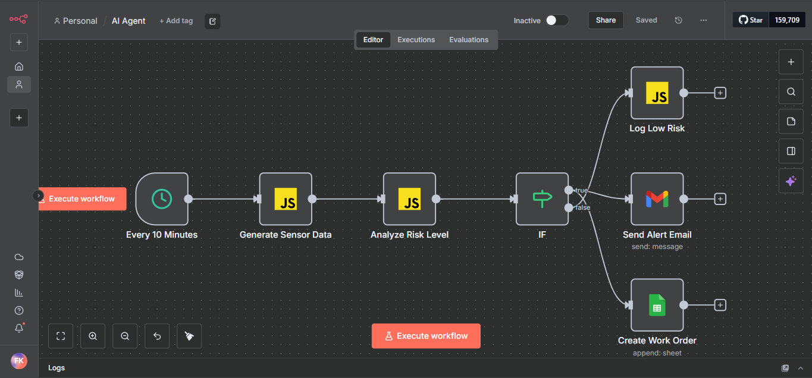
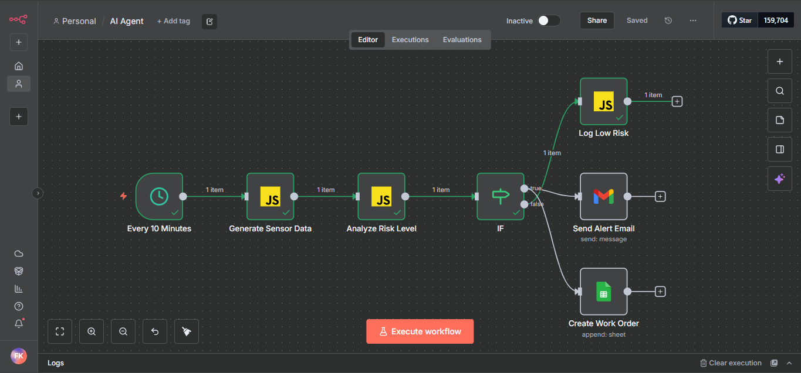

# Week 7 Assignment - AI For Software Engineering

## 📋 Repository Overview

This repository contains my complete submission for the AI Agents assignment, demonstrating comprehensive understanding of AI Agent frameworks, applications, and practical implementation. The assignment covers both theoretical analysis and hands-on implementation of AI Agent technology.

## 📁 Repository Structure

```
AI-Agents-Assignment/
│
├── README.md                          # This file - Complete project documentation
├── section_1.pdf                      # PDF containing Section 1: Short Answer Questions
├── section_2.pdf                      # PDF containing Section 2: Case Study Analysis
├── AI_Agent.json                      # Exported n8n workflow for predictive maintenance agent
└── screenshots/                       # Folder containing workflow screenshots
    ├── workflow-design.png
    ├── execution-success.png
```

## 🎯 Assignment Components

### Section 1: Theoretical Analysis
**File:** `section_1.pdf`

This document contains detailed answers to all five short-answer questions:

1. **Framework Comparison**: LangChain vs. AutoGen - Core functionalities, use cases, and limitations
2. **Supply Chain Transformation**: How AI Agents are revolutionizing supply chain management with specific examples
3. **Human-Agent Symbiosis**: The future of work and differentiation from traditional automation
4. **Ethical Implications**: Autonomous AI Agents in financial decision-making with proposed safeguards
5. **Technical Challenges**: Memory and state management in AI Agents for real-world applications

### Section 2: Case Study Analysis
**File:** `section_2.pdf`

**Case Study:** "Smart Manufacturing Implementation at AutoParts Inc."

Comprehensive analysis including:
- **Three AI Agent Implementation Strategy**:
  - Predictive Maintenance Agent
  - Computer Vision Quality Inspector Agent  
  - Production Planning & Customization Agent
- **ROI Analysis & Timeline**: Phased implementation with quantitative and qualitative benefits
- **Risk Assessment**: Technical, organizational, and ethical risks with mitigation strategies

## 🛠️ Practical Implementation: n8n Workflow

### Workflow File: `AI_Agent.json`
This file contains the exported workflow for the **Predictive Maintenance Agent** simulation built in n8n.cloud.

### Workflow Overview
The n8n workflow simulates an AI Agent for predictive maintenance in a manufacturing environment, specifically addressing AutoParts Inc.'s machine downtime challenges.

### Workflow Components

#### 🔄 **Trigger Node**
- **"Every 10 Minutes"**: Cron-scheduled trigger that initiates the workflow automatically

#### 🎛️ **Data Generation & Processing**
- **"Generate Sensor Data"**: Function node that creates mock sensor readings including:
  - Machine ID
  - Vibration levels (0-10 scale)
  - Temperature readings (60-110°C)
  - Timestamp

- **"Analyze Risk Level"**: AI Agent logic that evaluates sensor data against thresholds:
  - Vibration > 7.0 = Medium risk
  - Vibration > 8.5 = High risk
  - Temperature > 85°C = Medium risk
  - Temperature > 95°C = High risk
  - Calculates composite risk score and level

#### ⚡ **Decision & Action Nodes**
- **IF Node**: Routes workflow based on risk assessment
- **HIGH Risk Path**:
  - **"Send Alert Email"**: Notifies maintenance team immediately
  - **"Create Work Order"**: Automatically generates work order in maintenance system
- **LOW Risk Path**:
  - **"Log Low Risk"**: Records normal operation for audit trail

### Workflow Screenshots

#### 1. Complete Workflow Design

*The complete n8n workflow showing all connected nodes and data flow structure*

#### 2. Successful Execution

*Successful workflow execution with green checkmarks showing all nodes processed correctly*


### 🔧 Technical Implementation Details

#### Data Flow
```
Schedule Trigger → Sensor Data Generation → Risk Analysis → Decision Point
                                     |
                     ┌───────────────┴───────────────┐
               [HIGH Risk: Alert & Work Order]    [LOW Risk: Logging]
```

#### Risk Assessment Logic
```javascript
// Sample risk calculation from the workflow
if (vibration > 7.0) riskScore += 2;
if (vibration > 8.5) riskScore += 3;
if (temperature > 85) riskScore += 2;
if (temperature > 95) riskScore += 3;

if (riskScore >= 5) riskLevel = 'HIGH';
else if (riskScore >= 2) riskLevel = 'MEDIUM';
else riskLevel = 'LOW';
```

## 📞 Contact

**Student:** Fred Kaloki  
**Course:** AI For Sofware Engineering  
**Email:** charlesfred285@gmail.com

---